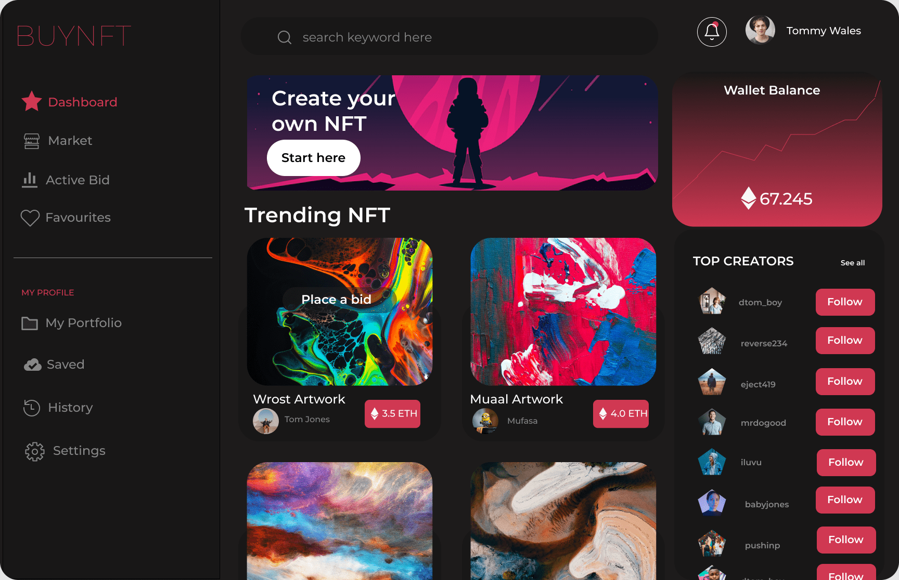

<!-- Please update value in the {}  -->

<h1 align="center">Buy Nft Dashboard</h1>

<div align="center">
  <h3>
    <a href="https://{https://buy-nft-dashboard.vercel.app/}">
      Demo
    </a>
    <span> | </span>
    <a href="https://{[Repo](https://github.com/SebasttianDaza/buyNftDashboard)}">
      Solution
    </a>
    <span> | </span>
    <a href="https://emprendeyourlifestyle.com/portafolio/">
      Website
    </a>
  </h3>
</div>

<!-- TABLE OF CONTENTS -->

## Table of Contents

- [Table of Contents](#table-of-contents)
- [Overview](#overview)
  - [Built With](#built-with)
- [How To Use](#how-to-use)
- [Contact](#contact)

<!-- OVERVIEW -->

## Overview



Website developed with ReactJS, React-Boostrap, Bootstrap, I've allow me to learn more about Components resuables and usefull. Also, of course I've been more easy with the components what it offers for default, but also I've customised it to my needs with SASS and CSS.

### Built With

<!-- This section should list any major frameworks that you built your project using. Here are a few examples.-->

- [React](https://reactjs.org/)
- [CSS](https://vuejs.org/)
- [Vercel](https://tailwindcss.com/)
- [React Icons](https://react-icons.netlify.com/)
- [Vite](https://vitejs.dev/)
- [React-Bootstrap](https://react-bootstrap.github.io/)
- [Bootstrap](https://getbootstrap.com/)
- [SASS](https://sass-lang.com/)


## How To Use

<!-- Example: -->

To clone and run this application, you'll need [Git](https://git-scm.com) and [Node.js](https://nodejs.org/en/download/) (which comes with [npm](http://npmjs.com)) installed on your computer. From your command line:

```bash
# Clone this repository
$ git clone https://github.com/your-user-name/your-project-name

# Install dependencies
$ npm install

# Run the app
$ npm run dev
```

## Contact

- Website [emprendeyourlifestyle.com](https://emprendeyourlifestyle.com/)
- GitHub [@SebasttianDaza](https://github.com/SebasttianDaza)
- Twitter [@SebasttianDaza](https://twitter.com/SebasttianDaza)